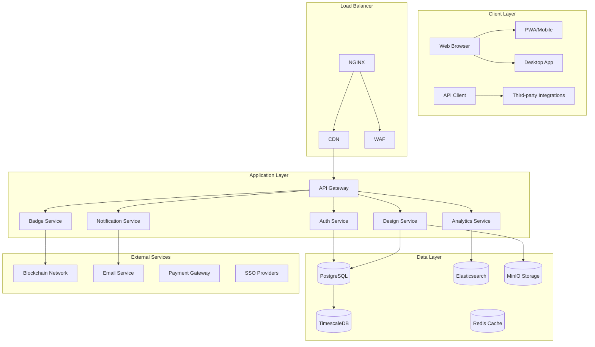

# 🏆 BadgeMaster Studio

<div align="center">


**The Ultimate Premium Digital Badge Design Platform**  
*Where Creativity Meets Professional Recognition*

[🚀 Live Demo](#live-demo) | [📖 Documentation](#documentation) | [💡 Features](#features) | [🛠 Installation](#installation) | [🏗 Architecture](#architecture) | [🤝 Contributing](#contributing)

</div>

---

## 🌟 Introduction

**BadgeMaster Studio** is not just another badge designer—it's a **revolutionary platform** that redefines digital credential creation, management, and distribution. Built with enterprise-grade architecture and stunning visual design, this platform serves organizations, educational institutions, and event managers who demand **perfection in digital recognition**.

> "The most sophisticated badge creation platform ever developed—transforming digital credentials into works of art."

---

## ✨ Key Highlights

- 🎨 **AI-Powered Design Engine** with smart templates
- 🏗 **Modular Architecture** for unlimited scalability
- 🔐 **Blockchain-Verified Credentials** (optional)
- 🌈 **Dynamic 3D & Interactive Badges**
- 📱 **Fully Responsive & Cross-Platform**
- 🚀 **Real-time Collaboration Tools**
- 📊 **Advanced Analytics Dashboard**

---

## 📋 Table of Contents

1. [Features](#features)
2. [Technology Stack](#technology-stack)
3. [System Architecture](#system-architecture)
4. [Installation Guide](#installation)
5. [Usage Examples](#usage)
6. [API Documentation](#api-documentation)
7. [Deployment](#deployment)
8. [Contributing](#contributing)
9. [License](#license)
10. [Support](#support)

---

## 🎯 Features

### 🎨 **Design & Customization**
- **Smart Template Library**: 500+ professionally designed templates
- **AI Design Assistant**: Suggests designs based on your content
- **Advanced Editor**: Layer-based editing with real-time preview
- **3D Badge Rendering**: Create badges with depth and animation
- **Brand Kit Integration**: Auto-apply brand colors, logos, and fonts
- **Bulk Generation**: Design thousands of badges simultaneously

### 🔧 **Technical Capabilities**
- **RESTful API**: Complete programmatic control
- **Webhooks System**: Real-time event notifications
- **Plugin Architecture**: Extend functionality with custom plugins
- **Multi-tenant Support**: Isolated workspaces for organizations
- **Version Control**: Track every change to badge designs
- **Export Formats**: SVG, PNG (4K), PDF, WebP, Animated GIF/WebM

### 📊 **Management & Analytics**
- **Dashboard Analytics**: Track badge issuance and engagement
- **Recipient Management**: Import/export recipient databases
- **Expiration & Renewal**: Automated lifecycle management
- **Verification Portal**: Public badge verification system
- **Usage Reports**: Detailed analytics and insights
- **Audit Logs**: Complete activity tracking

### 🛡 **Security & Compliance**
- **End-to-End Encryption**: For sensitive recipient data
- **GDPR Compliance**: Built-in privacy controls
- **Blockchain Anchoring**: Immutable credential records (optional)
- **Access Controls**: Role-based permissions (RBAC)
- **SSO Integration**: SAML, OAuth 2.0, OpenID Connect
- **Compliance Templates**: HIPAA, FERPA, SOC2 ready

---

## 🏗 Technology Stack

### **Frontend**
- **Framework**: React 18 + TypeScript
- **State Management**: Redux Toolkit + RTK Query
- **Styling**: Tailwind CSS + Framer Motion
- **3D Graphics**: Three.js + React Three Fiber
- **Charts**: Recharts + D3.js
- **Testing**: Jest + React Testing Library + Cypress

### **Backend**
- **Runtime**: Node.js 18+ with Express
- **Language**: TypeScript
- **API**: REST + GraphQL (Apollo Server)
- **Authentication**: Passport.js + JWT
- **Real-time**: Socket.io + Redis Pub/Sub

### **Database**
- **Primary**: PostgreSQL 14+ with TimescaleDB
- **Cache**: Redis 7+
- **Search**: Elasticsearch 8.x
- **File Storage**: MinIO (S3 compatible)

### **DevOps & Infrastructure**
- **Containerization**: Docker + Docker Compose
- **Orchestration**: Kubernetes manifests included
- **CI/CD**: GitHub Actions + ArgoCD
- **Monitoring**: Prometheus + Grafana + Loki
- **Logging**: ELK Stack (Elasticsearch, Logstash, Kibana)

---

## 🏛 System Architecture

### **High-Level Architecture Diagram**



### **Microservices Breakdown**

| Service | Purpose | Tech Stack |
|---------|---------|------------|
| **Auth Service** | Authentication & Authorization | Node.js, Redis, JWT |
| **Design Service** | Badge creation & editing | Canvas API, Three.js, Sharp |
| **Badge Service** | Badge issuance & management | PostgreSQL, BullMQ |
| **Analytics Service** | Data processing & insights | Python, Pandas, Elasticsearch |
| **Notification Service** | Email & webhook delivery | RabbitMQ, Nodemailer |
| **Verification Service** | Badge validation | Blockchain/DB verification |

---

## 🚀 Installation

### **Quick Start (Docker)**

```bash
# Clone the repository
git clone https://github.com/AshrafMorningstar/BadgeMaster-Studio.git
cd BadgeMaster-Studio

# Copy environment variables
cp .env.example .env

# Start with Docker Compose
docker-compose up -d

# Access the application
open http://localhost:3000
```

### **Manual Installation**

#### **Prerequisites**
- Node.js 18+
- PostgreSQL 14+
- Redis 7+
- MinIO or AWS S3

#### **Setup Steps**

```bash
# 1. Clone and install dependencies
git clone https://github.com/AshrafMorningstar/BadgeMaster-Studio.git
cd BadgeMaster-Studio

# 2. Install backend dependencies
cd backend
npm install

# 3. Install frontend dependencies
cd ../frontend
npm install

# 4. Set up environment variables
# Copy .env.example to .env and configure

# 5. Initialize database
cd ../backend
npm run db:migrate
npm run db:seed

# 6. Start development servers
npm run dev:all
```

### **Kubernetes Deployment**

```bash
# Apply Kubernetes manifests
kubectl apply -f k8s/namespace.yaml
kubectl apply -f k8s/configmaps.yaml
kubectl apply -f k8s/secrets.yaml
kubectl apply -f k8s/deployments.yaml
kubectl apply -f k8s/services.yaml
kubectl apply -f k8s/ingress.yaml
```

---

## 📖 Usage Examples

### **Creating a Badge Programmatically**

```typescript
import { BadgeMasterClient } from 'badgemaster-sdk';

const client = new BadgeMasterClient({
  apiKey: process.env.API_KEY,
  baseURL: 'https://api.badgemaster.com/v1'
});

// Create a new badge design
const badge = await client.badges.create({
  name: 'Python Expert',
  description: 'Awarded for mastering Python programming',
  template: 'professional_round',
  design: {
    colors: ['#306998', '#FFD43B'],
    layers: [
      {
        type: 'text',
        content: 'Python Expert',
        font: { family: 'Montserrat', size: 24, weight: 'bold' }
      },
      {
        type: 'icon',
        name: 'python',
        color: '#FFFFFF'
      }
    ]
  }
});

// Issue to recipients
const issuance = await client.issuances.create({
  badgeId: badge.id,
  recipients: [
    { email: 'alice@example.com', name: 'Alice Smith' },
    { email: 'bob@example.com', name: 'Bob Johnson' }
  ],
  expiresAt: '2024-12-31T23:59:59Z'
});
```

### **Bulk Badge Generation**

```bash
# Using CLI tool
badgemaster generate bulk \
  --template "certificate_of_completion" \
  --data recipients.csv \
  --output-dir ./badges \
  --format png,svg,pdf
```

---

## 🔌 API Documentation

### **Endpoints Overview**

| Method | Endpoint | Description |
|--------|----------|-------------|
| `GET` | `/api/v1/badges` | List badges |
| `POST` | `/api/v1/badges` | Create badge |
| `GET` | `/api/v1/badges/:id` | Get badge details |
| `PUT` | `/api/v1/badges/:id` | Update badge |
| `POST` | `/api/v1/issuances` | Issue badges |
| `GET` | `/api/v1/analytics/engagement` | Get engagement analytics |
| `POST` | `/api/v1/webhooks` | Manage webhooks |

### **Webhook Events**

```json
{
  "event": "badge.issued",
  "data": {
    "badgeId": "badge_123",
    "recipient": "user@example.com",
    "issuedAt": "2023-10-05T12:00:00Z",
    "verificationUrl": "https://verify.badgemaster.com/abc123"
  }
}
```

---

## 🌐 Deployment

### **Cloud Deployment Options**

1. **AWS** (Full CloudFormation templates included)
2. **Google Cloud Platform** (Terraform modules available)
3. **Azure** (ARM templates provided)
4. **DigitalOcean** (One-click deploy button)
5. **Self-hosted** (Complete on-premise solution)

### **Environment Configuration**

```yaml
# docker-compose.prod.yml
version: '3.8'

services:
  postgres:
    image: postgres:14-alpine
    environment:
      POSTGRES_DB: badgemaster
      POSTGRES_USER: ${DB_USER}
      POSTGRES_PASSWORD: ${DB_PASSWORD}
    volumes:
      - pg_data:/var/lib/postgresql/data

  redis:
    image: redis:7-alpine
    command: redis-server --requirepass ${REDIS_PASSWORD}

  # ... additional services
```

---

## 🤝 Contributing

We welcome contributions! Please see our [Contributing Guide](CONTRIBUTING.md) for details.

### **Development Workflow**

```bash
# 1. Fork the repository
# 2. Create a feature branch
git checkout -b feature/amazing-feature

# 3. Make changes and commit
git commit -m "Add amazing feature"

# 4. Push to branch
git push origin feature/amazing-feature

# 5. Open a Pull Request
```

### **Code Standards**
- TypeScript strict mode enabled
- ESLint + Prettier configuration included
- 80% test coverage required
- Conventional commits format

---

## 📄 License

This project is licensed under the **MIT License** - see the [LICENSE](LICENSE) file for details.

---

## 📞 Support

### **Need Help?**
- 📚 [Documentation](https://docs.badgemaster.studio)
- 🐛 [Issue Tracker](https://github.com/AshrafMorningstar/BadgeMaster-Studio/issues)
- 💬 [Discord Community](https://discord.gg/badgemaster)
- 📧 [Email Support](mailto:support@badgemaster.studio)

### **Enterprise Support**
For enterprise customers, we offer:
- 24/7 Priority Support
- Custom Development
- On-premise Deployment Assistance
- Training & Certification

---

## 🏆 Acknowledgments

- **Three.js** for amazing 3D capabilities
- **Tailwind CSS** for the utility-first styling
- **PostgreSQL & TimescaleDB** for robust data storage
- **All our amazing contributors** ❤️

---

<div align="center">

### **Ready to transform your digital recognition program?**

[](https://console.aws.amazon.com)
[](https://github.com/AshrafMorningstar/BadgeMaster-Studio/fork)
[](https://discord.gg/badgemaster)

**Star this repo if you find it useful!** ⭐

---

**BadgeMaster Studio** © 2023 - Present | Crafted with ❤️ by [Ashraf Morningstar](https://github.com/AshrafMorningstar) and contributors

</div>
